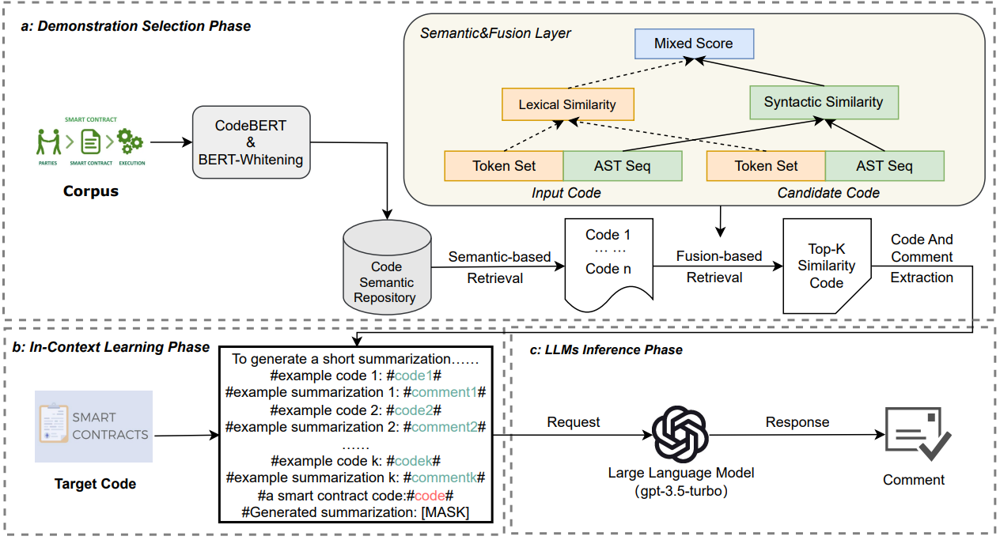

# SCCLLM: Automatic Smart Contract Comment Generation via Large Language Models and In-Context Learning

This is the source code to the paper "SCCLLM: Automatic Smart Contract Comment Generation via Large Language Models and In-Context Learning". Please refer to the paper for the experimental details.

# Approach



 ## About the Datasets
In our work, we use two folders to store the data.

1. In the data folder, we store the data sets after processing, including the training sets, test sets and validation sets of code, comments and AST sequences.

2. In the large model data folder, store the data needed in the prompt template, including the top-k demonstrations provided, the test code, and the comments for the first code snippet retrieved.
3. The raw data can be referenced from our previous work：https://github.com/NTDXYG/CCGIR

## About the Models

Our work is mainly divided into retrieval model and large language model.

**Notes in retrieval model：**

- "model" directory is generated by CodeBert vector of warehouses and whitening solution of kernel and bias(need to download[CodeBert](https://huggingface.co/microsoft/codebert-base)  on your local hard drive). Due to the large amount of data in the model folder, we uploaded the file to [Google Cloud Drive](https://drive.google.com/drive/folders/1CUubCx-wXVJ6TZkJcCIkUkwh61hq3rGe?usp=sharing) for everyone to download.
- util.py is a toolkit that includes AST parsing, code preprocessing, and comment preprocessing.
- bert_whitening.py is a file operated with CodeBert+whitening.
- CCGIR.py is a encapsulated retrieval file that uses the Faiss-CPU.


**Notes in large language model：**

- LLM.py is code that modifies the prompt template and invokes the API interface. To use it, you need to install the openAI library in advance, which you can do with the following code.

```
 pip install openai
```

- To run LLM.py, you need to replace openai.api_base, openai.api_key on lines 9 and 10 with your own URL and key.

## How to use our method SCCLLM in a new corpus:

To use our method on a new dataset you need to complete two steps: 1): Retrieve top-k demonstrations; 2): Invoke the API to generate comments.

**Retrieve top-k demonstrations**

1. Open bert_whitening.py. Line 8: the POOLING method can be selected by yourself. We select 'first_last_avg' for the best result. Line 13 N_COMPONENTS is the selected dimension after the reduction, after the superparameter verification, 256 is better. MAX_LENGTH, line 14, is the maximum length of the participle entered before Codebert. There is a tqdm in lines 28 and 29, and you can choose whether to turn it on or not. Line 84 pd.read_csv(), the file inside is changed to the code file of the new training set. 

   ```
   df = pd.read_csv("data/train_base_function.csv", header=None)
   ```

   Line 99,102,105, modify the save path address according to your needs.

When you're done, run the main function. After running, we get the semantic vector library of the training set, kernel and bias.

2. Open ccgpir. py. dim in line 16 is the dimension after the reduction is selected. Next, change the address of the file on lines 18 through 29, and change the address of the file on lines 47, 49, and 53. 

   ```
   df = pd.read_csv("data/train_base_function.csv", header=None)
   train_code_list = df[0].tolist()
   ```

   Just run the main function directly on the new test/validation set.

**Use LLMs to generate comments**

1. Open LLM.py. Modify your own prompt template, including prompt words and demonstration input, in the comment function on line 12.
2. Modify lines 37 through 64 for your own data set and the provided demonstration. Run LLM.py directly when you're done

By following these steps, you should be able to replicate our experiments and obtain similar results. Please let us know if you encounter any issues during the process, and we will be happy to assist you.

# Citation

```

```

